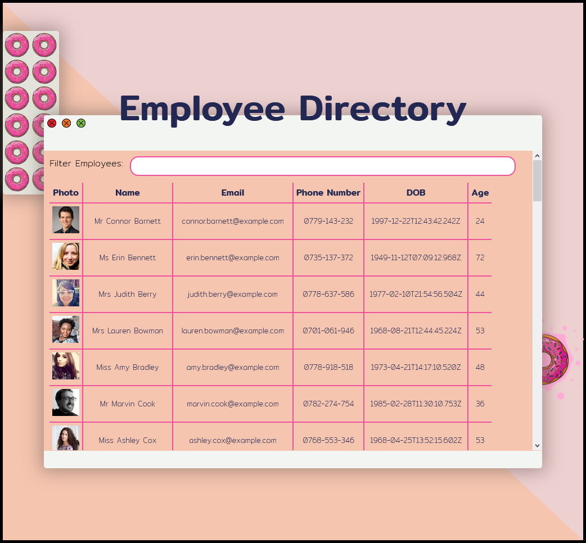
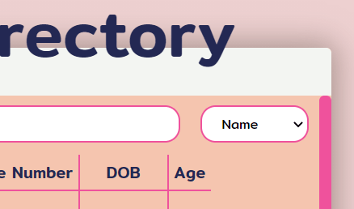
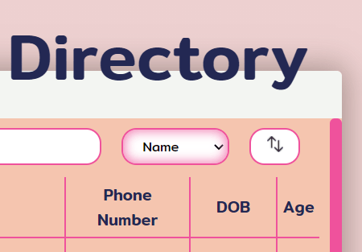
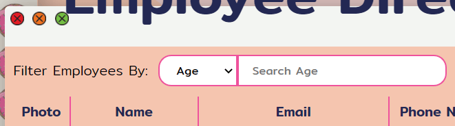
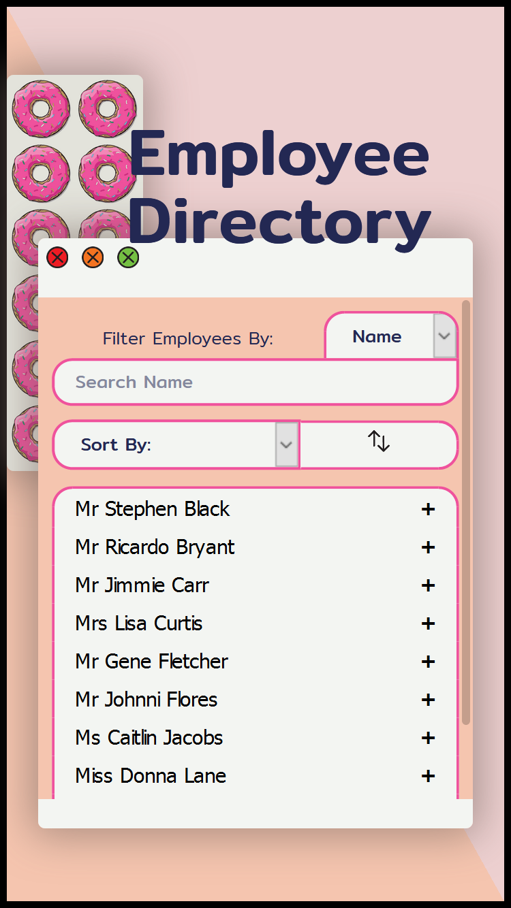
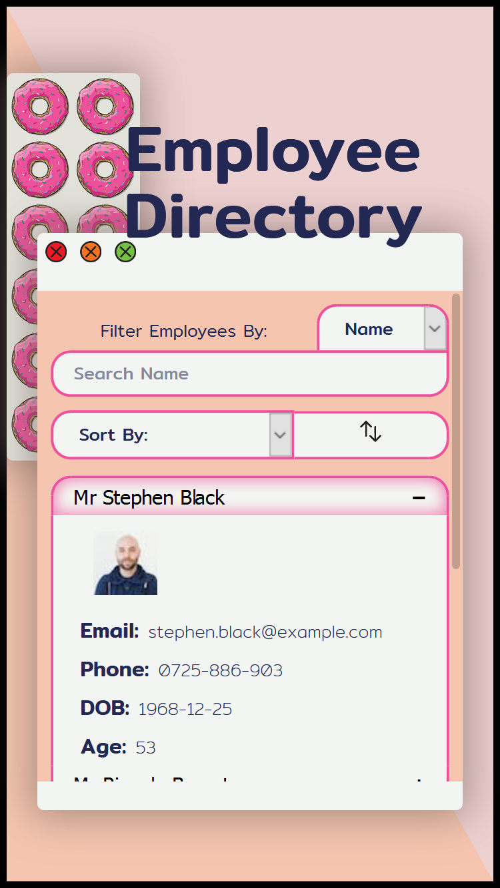

# Employee Directory - React 

This is an application that demonstrates the display of an employee directory using React and Random User Generator. 

---

#### User Story

As a user, I want to be able to view my entire employee directory at once so that I have quick access to their information.

#### Business Context

An employee or manager would benefit greatly from being able to view non-sensitive data about other employees. It would be particularly helpful to be able to filter employees by name.

---

My project stands out by the use of state and apparent memory of your last chosen filter /sort action. The user can manipluate the data in any order they choose and the UI will further filter or sort the data they have infront of them. 

In addition the app is fully mobile responsive, changing from a table to a collapsible accordian when the contents is too big for the table display.

During this project I have learnt how to break up an application’s UI into React components and manage component state, responding to user events. I have been able to use react-responsive and look at react-collapsible although I chose to build my own accordian from scratch.

## Contents: 
1. [Installation](#Instalation) 
2. [Usage](#Usage)
3. [Improvements](#Improvements)
4. [Updates](#Updates)
5. [Credits](#Credits)
6. [License](#License)
7. [Contact](#Contact)

## Installation

* Step 1: Download the zip file of the project.
* Step 2: Install the npm dependencies to your machine using first `>npm init`, then `>npm install <package name>`.

* The package was built using `Create-React-App`. 

### Project dependencies

* Node.js
* React
* React-responsive npm package
* gh-pages

### Technologies 

Languages I have used are:
* Javascript
* HTML
* CSS
* React

## Usage

* Step 1: You can utilise nodemon by running the command from your terminal `>npm run start`

To use the App you can visit the deployment on [Github Pages](https://samwakelam.github.io/19_REACT_EMPLOYEE_DEIRECTORY_SLW/).

## Improvements

Required: 
* There needs to be a sort feature added to the application. The API data is already sorted by alphabetical order by last name; functionality for the employeer to sort by another field is requiered. - Update (20.02.2021).

  Improvements needed after update (20.02.2021) 
  * The reverse data button works on none consecutive calls. This needs to be able to be called multiple times in succession. - Update (22.02.2021)

I would like to add: 
* Mobile Responsiveness. - Update (22.02.2021)
* Filter by ... select option. - Update (21.02.2021)

## Updates 

(20.02.2021)
 - Sort feature added 

- Sort will remember state of all previous requests. ie, if you filter and then sort by age it will maintain the filter. It will then further remember your filter if you change back to neutral option 'Sort By'. It will even remmeber how you sorted the data if you remove and add a new filter. 

- Reverse Data button added. 
Needs improvement, you can reverse data once per sort or filter but not sequentially. 

(21.02.2021)
- Filter field can be changed between name, age and date of birth. The user can enter month both as a string and a numeric value 

(22.02.2021)
- The app is fully mobile responsive and makes use of the npm package react-responsive.

- The reverse datat feature works consecutively.
    
## Credits 

Resources I have referenced:   
* docs.mongodb.com
* mongoosejs.com

## License 

* GNU GPL v3   

Where appropriate: 
Alot of the graphics included in my projects I have drawn myself and are copyright 2021. 
No useage without permission. 
If I have not originated the imagery I have gained the permission of the owner and acreditied 
where necessary. These are also not for re-purpose without permission of the owner.

You must make reference where the code originated. I would also love to see what changes and improvements you make.  
Design by Samantha Wakelam, please respect copyright 2020. 

## Contact

* Name: Samantha Wakelam   Email: sam.wakelam@hotmail.co.uk  Github Profile: Sam Wakelam 